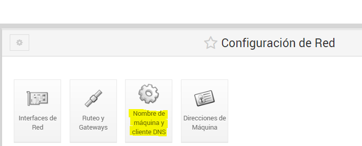
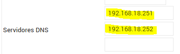
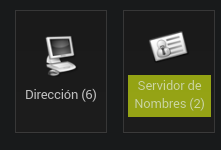
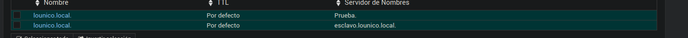
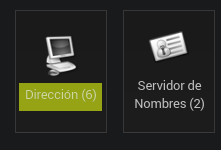
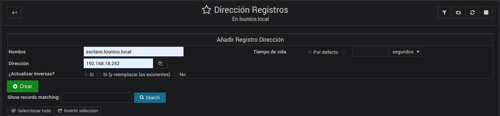

Para hacer esta actividad necesitas dos maquinas de Ubuntu Server una en la que abeis creado la zona primaria y los registros 
y otra nueva donde ira el servidor secundario.

En la configuracion de red del servidor primario añadimos en el DNS predefinido la ip del servidor secundario. Luego, en la configuracion del servidor secundario o esclavo hacemos la misma configuracion vista anteriormente pero poniendole una ip distinta y en servior DNS ponemos la ip del primario y la del secundario.

A demas, para configurar el servidor secundario o esclavo primero debemos hacer unos cambios en el servidor primario.

1.Entramos en la zona maestra o principal de busqueda directa en nuestro servidor principal y enramos a "servidor de nombres"
una vez hay ponemos lo siguente.

2.Luego entramos en "direcciónes" y ponemos el nombre del servidor secundario y su ip,
despues le damos a crear.

3.A continuacion entramos en "editar opciones de zona" y permitimos la tranferencia
a nuestro servidor secundrio poniendo la ip.

4.Ahora vamos a la zona de busqueda inversa y hacemos lo siguente.

5.Despues, en "direccion inversa" ponemos la ip y el nombre del servidor secundario. (Si teneis puesto que se actualice, en las direcciones de la zona directa no sera nescasrio ponerlo ya que se pondra solo).

6.Por ultimo tambien ablitaremos la tranferencia en la zona imbersa como lo hemos echo antes desde opciones de zona.

7.Seguidamente entramos en el webmin del servidor secundario y con el bind ya instalado vamos a añadir una zona esclava de tipo directa.

8.Ahora creamos otra pero de busqueda inversa de la siguente forma.

9.Por último para comprobar que funciona correctamente
